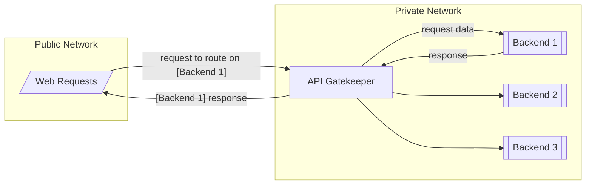

# API Gatekeeper

A simple API and user management gateway.



## Use Cases

The API Gatekeeper is a application that sits between the public web requests and your backends (monoliths, microsservices, etc.). It focus on the following use cases:

- **API Gateway:** api-gatekeeper allows you to expose multiple HTTP backends on the same host using the included auth.
- **User Management:** api-gatekeeper comes with a full featured user resource system, with scope based authentication and authorization.

## Requirements

1. Any operating system that can run the released binaries
2. A compatible database. Supported databases:
   - [PostgreSQL](https://www.postgresql.org/), version 12+

## Usage

1. Download the latest application binary from the [Releases page](https://github.com/gustapinto/api-gatekeeper/releases)
2. Create a [configuration](https://github.com/gustapinto/api-gatekeeper?tab=readme-ov-file#configuration) file. There is a example on [examples/config.yaml](https://github.com/gustapinto/api-gatekeeper/blob/main/example/config.yaml)
3. Start the application using the configuration file with the command:
   ```bash
   ./api-gatekeeper-linux-amd64 -config=<path to>/config.yaml
   ```

## Configuration

The configuration is done by a yaml file. This file path must be provided by the `-config=<path to yaml>` when running the application. An example config can be found at [examples/config.yaml](https://github.com/gustapinto/api-gatekeeper/blob/main/example/config.yaml))

## User Management

Alongside the API Gateway capabilities this application is also powered with a simple user management system.

This is done using the integrated REST API, the example requests can be found on the [requests.http](https://github.com/gustapinto/api-gatekeeper/blob/main/requests.http) file on this repository root;

## FAQ

### Is this application production ready?

In the moment **No**.
